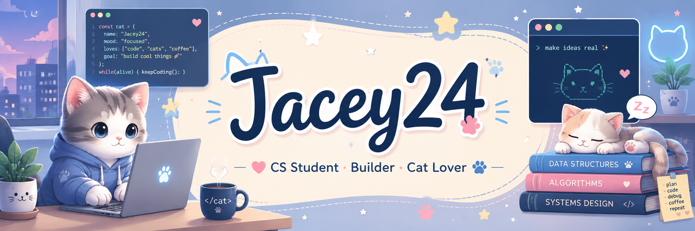

<div align="center">
  

  # Hi, I'm Jacey24 🐾

  **在代码与猫咪之间，保持好奇。**

  <a href="https://github.com/Jacey24?tab=followers">
    
  </a>
  
</div>

---

### About me

- 🌱 持续学习，慢慢把想法变成作品
- 🐈 喜欢猫咪，也喜欢简洁、好用的东西
- ✨ `Keep it curious. Keep it kind.`

### GitHub activity

- 📚 [查看我的公开仓库](https://github.com/Jacey24?tab=repositories)
- 🌱 [查看我的贡献记录](https://github.com/Jacey24)

<details>
  <summary><strong>Cat corner</strong> 🐱</summary>

```text
 /\_/\\
( o.o )   Thanks for stopping by!
 > ^ <
```

</details>

---

<div align="center">
  <sub>Made with curiosity, code, and a little bit of cat hair.</sub>
</div>
